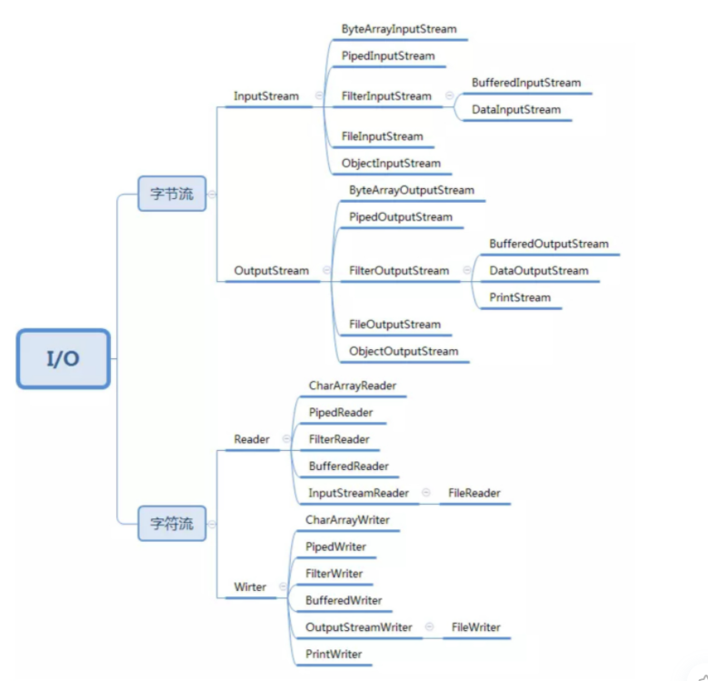

# 设计模式
## 单例模式
一个类只允许创建一个对象（或者实例），那这个类就是一个单例类，这种设计模式就叫作单例设计模式，简称单例模式

- 构造函数需要是 private 访问权限的，这样才能避免外部通过 new 创建实例；
- 考虑对象创建时的线程安全问题；
- 考虑是否支持延迟加载；
- 考虑 getInstance() 性能是否高（是否加锁）。

- 饿汉式：
饿汉式的实现方式，在类加载的期间，就已经将 instance 静态实例初始化好了，所以，instance 实例的创建是线程安全的。不过，这样的实现方式不支持延迟加载实例。
- 懒汉式：
懒汉式相对于饿汉式的优势是支持延迟加载。这种实现方式会导致频繁加锁、释放锁，以及并发度低等问题，频繁的调用会产生性能瓶颈。
- 双重检测：
双重检测实现方式既支持延迟加载、又支持高并发的单例实现方式。只要 instance 被创建之后，再调用 getInstance() 函数都不会进入到加锁逻辑中。所以，这种实现方式解决了懒汉式并发度低的问题。
- 静态内部类：
利用 Java 的静态内部类来实现单例。这种实现方式，既支持延迟加载，也支持高并发，实现起来也比双重检测简单。
- 枚举：
最简单的实现方式，基于枚举类型的单例实现。这种实现方式通过 Java 枚举类型本身的特性，保证了实例创建的线程安全性和实例的唯一性。

单例存在哪些问题？
- 单例对 OOP 特性的支持不友好
- 单例会隐藏类之间的依赖关系
- 单例对代码的扩展性不友好
- 单例对代码的可测试性不友好
- 单例不支持有参数的构造函数

单例有什么替代解决方案？
- 通过工厂模式、IOC 容器（比如 Spring IOC 容器）来保证，由过程序员自己来保证（自己在编写代码的时候自己保证不要创建两个类对象）

## 工厂模式
- 简单工厂模式：实例的创建比较简单
- 工厂方法模式：实例的创建比较复杂，需要拆分为多个工厂进行创建
- 抽象工厂模式：实例有多种创建的方式，需要各个工厂都支持多种方式创建实例

工厂模式的作用：
- 封装变化：创建逻辑有可能变化，封装成工厂类之后，创建逻辑的变更对调用者透明。
- 代码复用：创建代码抽离到独立的工厂类之后可以复用。
- 隔离复杂性：封装复杂的创建逻辑，调用者无需了解如何创建对象。
- 控制复杂度：将创建代码抽离出来，让原本的函数或类职责更单一，代码更简洁。

## 建造者模式
```java
public class ResourcePoolConfig {
    private String name;
    private int maxTotal;
    private ResourcePoolConfig(Builder builder) {
        this.name = builder.name;
        this.maxTotal = builder.maxTotal;
    }
    //...省略getter方法...
    //我们将Builder类设计成了ResourcePoolConfig的内部类。
    //我们也可以将Builder类设计成独立的非内部类ResourcePoolConfigBuilder。
    public static class Builder {
        private static final int DEFAULT_MAX_TOTAL = 8;
        private String name;
        private int maxTotal = DEFAULT_MAX_TOTAL;
        public ResourcePoolConfig build() {
            // 校验逻辑放到这里来做，包括必填项校验、依赖关系校验、约束条件校验等
            if (StringUtils.isBlank(name)) {
                throw new IllegalArgumentException("...");
            }
            if (maxIdle > maxTotal) {
                throw new IllegalArgumentException("...");
            }
            return new ResourcePoolConfig(this);
        }
        public Builder setName(String name) {
            if (StringUtils.isBlank(name)) {
                throw new IllegalArgumentException("...");
            }
            this.name = name;
            return this;
        }
        public Builder setMaxTotal(int maxTotal) {
            if (maxTotal <= 0) {
                throw new IllegalArgumentException("...");
            }
            this.maxTotal = maxTotal;
            return this;
        }
    }
}
// 这段代码会抛出IllegalArgumentException，因为minIdle>maxIdle
ResourcePoolConfig config = new ResourcePoolConfig.Builder()
        .setName("dbconnectionpool")
        .setMaxTotal(16)
        .setMaxIdle(10)
        .setMinIdle(12)
        .build();
```

与工厂模式有何区别
- 工厂模式是用来创建不同但是相关类型的对象（继承同一父类或者接口的一组子类），由给定的参数来决定创建哪种类型的对象
- 建造者模式是用来创建一种类型的复杂对象，通过设置不同的可选参数，“定制化”地创建不同的对象

考虑使用建造者模式的场景
- 我们把类的必填属性放到构造函数中，强制创建对象的时候就设置。如果必填的属性有很多，把这些必填属性都放到构造函数中设置，那构造函数就又会出现参数列表很长的问题。如果我们把必填属性通过 set() 方法设置，那校验这些必填属性是否已经填写的逻辑就无处安放了
- 如果类的属性之间有一定的依赖关系或者约束条件，我们继续使用构造函数配合 set() 方法的设计思路，那这些依赖关系或约束条件的校验逻辑就无处安放了
- 如果我们希望创建不可变对象，也就是说，对象在创建好之后，就不能再修改内部的属性值，要实现这个功能，我们就不能在类中暴露 set() 方法。构造函数配合 set() 方法来设置属性值的方式就不适用了

## 原型模式
如果对象的创建成本比较大，而同一个类的不同对象之间差别不大（大部分字段都相同），在这种情况下，我们可以利用对已有对象（原型）进行复制（或者叫拷贝）的方式来创建新对象，以达到节省创建时间的目的

深拷贝和浅拷贝
- 浅拷贝只会复制对象中基本数据类型数据和引用对象的内存地址，不会递归地复制引用对象
- 深拷贝得到的是一份完完全全独立的对象，更加耗时，更加耗内存空间

##代理模式
1. 代理模式的原理与实现

在不改变原始类（或叫被代理类）的情况下，通过引入代理类来给原始类附加功能。一般情况下，我们让代理类和原始类实现同样的接口。但是，如果原始类并没有定义接口，并且原始类代码并不是我们开发维护的。在这种情况下，我们可以通过让代理类继承原始类的方法来实现代理模式。
2. 动态代理的原理与实现
   
静态代理需要针对每个类都创建一个代理类，并且每个代理类中的代码都有点像模板式的“重复”代码，增加了维护成本和开发成本。对于静态代理存在的问题，我们可以通过动态代理来解决。我们不事先为每个原始类编写代理类，而是在运行的时候动态地创建原始类对应的代理类，然后在系统中用代理类替换掉原始类。
3. 代理模式的应用场景
   
代理模式常用在业务系统中开发一些非功能性需求，比如：监控、统计、鉴权、限流、事务、幂等、日志。我们将这些附加功能与业务功能解耦，放到代理类统一处理，让程序员只需要关注业务方面的开发。除此之外，代理模式还可以用在 RPC、缓存等应用场景中。

## 桥接模式
将抽象和实现解耦，让它们可以独立变化。
一个类存在两个（或多个）独立变化的维度，我们通过组合的方式，让这两个（或多个）维度可以独立进行扩展。
JDBC 驱动是桥接模式的经典应用。
```java

public interface MsgSender {
  void send(String message);
}
public class TelephoneMsgSender implements MsgSender {
  private List<String> telephones;
  public TelephoneMsgSender(List<String> telephones) {
    this.telephones = telephones;
  }
  @Override
  public void send(String message) {
    //...
  }
}
public class EmailMsgSender implements MsgSender {
  // 与TelephoneMsgSender代码结构类似，所以省略...
}
public class WechatMsgSender implements MsgSender {
  // 与TelephoneMsgSender代码结构类似，所以省略...
}
public abstract class Notification {
  protected MsgSender msgSender;
  public Notification(MsgSender msgSender) {
    this.msgSender = msgSender;
  }
  public abstract void notify(String message);
}
public class SevereNotification extends Notification {
  public SevereNotification(MsgSender msgSender) {
    super(msgSender);
  }
  @Override
  public void notify(String message) {
    msgSender.send(message);
  }
}
public class UrgencyNotification extends Notification {
  // 与SevereNotification代码结构类似，所以省略...
}
public class NormalNotification extends Notification {
  // 与SevereNotification代码结构类似，所以省略...
}
public class TrivialNotification extends Notification {
  // 与SevereNotification代码结构类似，所以省略...
}
```

## 装饰器模式
装饰器模式主要解决继承关系过于复杂的问题，通过组合来替代继承。它主要的作用是给原始类添加增强功能
- 装饰器类和原始类继承同样的父类，这样我们可以对原始类“嵌套”多个装饰器类
- 装饰器类是对功能的增强，这也是装饰器模式应用场景的一个重要特点
jdk i/o类是典型的装饰器实现
  


## 适配器模式
顾名思义，这个模式就是用来做适配的，它将不兼容的接口转换为可兼容的接口，让原本由于接口不兼容而不能一起工作的类可以一起工作

一般来说，适配器模式可以看作一种“补偿模式”，用来补救设计上的缺陷。应用这种模式算是“无奈之举”。如果在设计初期，我们就能协调规避接口不兼容的问题，那这种模式就没有应用的机会了

什么情况下才会出现接口不兼容?
1. 封装有缺陷的接口设计
2. 统一多个类的接口设计
3. 替换依赖的外部系统
4. 兼容老版本接口
5. 适配不同格式的数据

## 门面模式（外观模式）
门面模式为子系统提供一组统一的接口，定义一组高层接口让子系统更易用

门面模式的应用场景:
1. 解决易用性问题
2. 解决性能问题
3. 解决分布式事务问题

## 组合模式
将一组对象组织（Compose）成树形结构，以表示一种“部分 - 整体”的层次结构。组合让客户端（在很多设计模式书籍中，“客户端”代指代码的使用者。）可以统一单个对象和组合对象的处理逻辑

组合模式的设计思路，与其说是一种设计模式，倒不如说是对业务场景的一种数据结构和算法的抽象。其中，数据可以表示成树这种数据结构，业务需求可以通过在树上的递归遍历算法来实现。

组合模式，将一组对象组织成树形结构，将单个对象和组合对象都看做树中的节点，以统一处理逻辑，并且它利用树形结构的特点，递归地处理每个子树，依次简化代码实现。使用组合模式的前提在于，你的业务场景必须能够表示成树形结构。所以，组合模式的应用场景也比较局限，它并不是一种很常用的设计模式

```java
public abstract class FileSystemNode {
  protected String path;
  public FileSystemNode(String path) {
    this.path = path;
  }
  public abstract int countNumOfFiles();
  public abstract long countSizeOfFiles();
  public String getPath() {
    return path;
  }
}
public class File extends FileSystemNode {
  public File(String path) {
    super(path);
  }
  @Override
  public int countNumOfFiles() {
    return 1;
  }
  @Override
  public long countSizeOfFiles() {
    java.io.File file = new java.io.File(path);
    if (!file.exists()) return 0;
    return file.length();
  }
}
public class Directory extends FileSystemNode {
  private List<FileSystemNode> subNodes = new ArrayList<>();
  public Directory(String path) {
    super(path);
  }
  @Override
  public int countNumOfFiles() {
    int numOfFiles = 0;
    for (FileSystemNode fileOrDir : subNodes) {
      numOfFiles += fileOrDir.countNumOfFiles();
    }
    return numOfFiles;
  }
  @Override
  public long countSizeOfFiles() {
    long sizeofFiles = 0;
    for (FileSystemNode fileOrDir : subNodes) {
      sizeofFiles += fileOrDir.countSizeOfFiles();
    }
    return sizeofFiles;
  }
  public void addSubNode(FileSystemNode fileOrDir) {
    subNodes.add(fileOrDir);
  }
  public void removeSubNode(FileSystemNode fileOrDir) {
    int size = subNodes.size();
    int i = 0;
    for (; i < size; ++i) {
      if (subNodes.get(i).getPath().equalsIgnoreCase(fileOrDir.getPath())) {
        break;
      }
    }
    if (i < size) {
      subNodes.remove(i);
    }
  }
}
```

## 享元模式
所谓“享元”，顾名思义就是被共享的单元。享元模式的意图是复用对象，节省内存，前提是享元对象是不可变对象
1. 享元模式的原理 

当一个系统中存在大量重复对象的时候，我们就可以利用享元模式，将对象设计成享元，在内存中只保留一份实例，供多处代码引用，这样可以减少内存中对象的数量，以起到节省内存的目的。实际上，不仅仅相同对象可以设计成享元，对于相似对象，我们也可以将这些对象中相同的部分（字段），提取出来设计成享元，让这些大量相似对象引用这些享元

2. 享元模式的实现

享元模式的代码实现非常简单，主要是通过工厂模式，在工厂类中，通过一个 Map 或者 List 来缓存已经创建好的享元对象，以达到复用的目的

3. 享元模式 VS 单例、缓存、对象池

应用单例模式是为了保证对象全局唯一。应用享元模式是为了实现对象复用，节省内存。缓存是为了提高访问效率，而非复用。池化技术中的“复用”理解为“重复使用”，主要是为了节省时间

## 观察者模式
在对象之间定义一个一对多的依赖，当一个对象状态改变的时候，所有依赖的对象都会自动收到通知

观察者模式的应用场景非常广泛，小到代码层面的解耦，大到架构层面的系统解耦，再或者一些产品的设计思路，都有这种模式的影子，比如，邮件订阅、RSS Feeds，本质上都是观察者模式。不同的应用场景和需求下，这个模式也有截然不同的实现方式，有同步阻塞的实现方式，也有异步非阻塞的实现方式；有进程内的实现方式，也有跨进程的实现方式

## 模板模式
模板方法模式在一个方法中定义一个算法骨架，并将某些步骤推迟到子类中实现。模板方法模式可以让子类在不改变算法整体结构的情况下，重新定义算法中的某些步骤。

模板模式有两大作用：复用和扩展。
- 复用指的是，所有的子类可以复用父类中提供的模板方法的代码。
- 扩展指的是，框架通过模板模式提供功能扩展点，让框架用户可以在不修改框架源码的情况下，基于扩展点定制化框架的功能。
```java
public abstract class AbstractClass {
  public final void templateMethod() {
    //...
    method1();
    //...
    method2();
    //...
  }
  
  protected abstract void method1();
  protected abstract void method2();
}
public class ConcreteClass1 extends AbstractClass {
  @Override
  protected void method1() {
    //...
  }
  
  @Override
  protected void method2() {
    //...
  }
}
public class ConcreteClass2 extends AbstractClass {
  @Override
  protected void method1() {
    //...
  }
  
  @Override
  protected void method2() {
    //...
  }
}
AbstractClass demo = ConcreteClass1();
demo.templateMethod();
```

回调的原理:
相对于普通的函数调用来说，回调是一种双向调用关系。A 类事先注册某个函数 F 到 B 类，A 类在调用 B 类的 P 函数的时候，B 类反过来调用 A 类注册给它的 F 函数。这里的 F 函数就是“回调函数”。A 调用 B，B 反过来又调用 A，这种调用机制就叫作“回调”

```java
public interface ICallback {
  void methodToCallback();
}
public class BClass {
  public void process(ICallback callback) {
    //...
    callback.methodToCallback();
    //...
  }
}
public class AClass {
  public static void main(String[] args) {
    BClass b = new BClass();
    b.process(new ICallback() { //回调对象
      @Override
      public void methodToCallback() {
        System.out.println("Call back me.");
      }
    });
  }
}
```

模板模式 VS 回调

- 从应用场景上来看，同步回调跟模板模式几乎一致。它们都是在一个大的算法骨架中，自由替换其中的某个步骤，起到代码复用和扩展的目的。而异步回调跟模板模式有较大差别，更像是观察者模式
- 从代码实现上来看，回调和模板模式完全不同。回调基于组合关系来实现，把一个对象传递给另一个对象，是一种对象之间的关系；模板模式基于继承关系来实现，子类重写父类的抽象方法，是一种类之间的关系

回调相对于模板模式会更加灵活，主要体现在下面几点

- 像 Java 这种只支持单继承的语言，基于模板模式编写的子类，已经继承了一个父类，不再具有继承的能力
- 回调可以使用匿名类来创建回调对象，可以不用事先定义类；而模板模式针对不同的实现都要定义不同的子类
- 如果某个类中定义了多个模板方法，每个方法都有对应的抽象方法，那即便我们只用到其中的一个模板方法，子类也必须实现所有的抽象方法。而回调就更加灵活，我们只需要往用到的模板方法中注入回调对象即可

## 策略模式
定义一族算法类，将每个算法分别封装起来，让它们可以互相替换。策略模式可以使算法的变化独立于使用它们的客户端（这里的客户端代指使用算法的代码）

策略模式用来解耦策略的定义、创建、使用:
- 策略类的定义比较简单，包含一个策略接口和一组实现这个接口的策略类
- 策略的创建由工厂类来完成，封装策略创建的细节
- 策略模式包含一组策略可选，客户端代码如何选择使用哪个策略，有两种确定方法：编译时静态确定和运行时动态确定。其中，“运行时动态确定”才是策略模式最典型的应用场景


```java
// 策略接口：EvictionStrategy
// 策略类：LruEvictionStrategy、FifoEvictionStrategy、LfuEvictionStrategy...
// 策略工厂：EvictionStrategyFactory
public class UserCache {
  private Map<String, User> cacheData = new HashMap<>();
  private EvictionStrategy eviction;
  public UserCache(EvictionStrategy eviction) {
    this.eviction = eviction;
  }
  //...
}
// 运行时动态确定，根据配置文件的配置决定使用哪种策略
public class Application {
  public static void main(String[] args) throws Exception {
    EvictionStrategy evictionStrategy = null;
    Properties props = new Properties();
    props.load(new FileInputStream("./config.properties"));
    String type = props.getProperty("eviction_type");
    evictionStrategy = EvictionStrategyFactory.getEvictionStrategy(type);
    UserCache userCache = new UserCache(evictionStrategy);
    //...
  }
}
// 非运行时动态确定，在代码中指定使用哪种策略
public class Application {
  public static void main(String[] args) {
    //...
    EvictionStrategy evictionStrategy = new LruEvictionStrategy();
    UserCache userCache = new UserCache(evictionStrategy);
    //...
  }
}
```

## 职责链模式
将请求的发送和接收解耦，让多个接收对象都有机会处理这个请求。将这些接收对象串成一条链，并沿着这条链传递这个请求，直到链上的某个接收对象能够处理它为止

作用：让代码满足开闭原则，提高代码的扩展性

```java
public abstract class Handler {
    protected Handler successor = null;
    public void setSuccessor(Handler successor) {
        this.successor = successor;
    }
    public final void handle() {
        boolean handled = doHandle();
        if (successor != null && !handled) {
            successor.handle();
        }
    }
    protected abstract boolean doHandle();
}
public class HandlerA extends Handler {
    @Override
    protected boolean doHandle() {
        boolean handled = false;
        //...
        return handled;
    }
}
public class HandlerB extends Handler {
    @Override
    protected boolean doHandle() {
        boolean handled = false;
        //...
        return handled;
    }
}
public class HandlerChain {
    private Handler head = null;
    private Handler tail = null;
    public void addHandler(Handler handler) {
        handler.setSuccessor(null);
        if (head == null) {
            head = handler;
            tail = handler;
            return;
        }
        tail.setSuccessor(handler);
        tail = handler;
    }
    public void handle() {
        if (head != null) {
            head.handle();
        }
    }
}
// 使用举例
public class Application {
    public static void main(String[] args) {
        HandlerChain chain = new HandlerChain();
        chain.addHandler(new HandlerA());
        chain.addHandler(new HandlerB());
        chain.handle();
    }
}
```

## 状态模式
状态模式是状态机的一种实现方式即可。状态机又叫有限状态机，它有 3 个部分组成：状态、事件、动作。其中，事件也称为转移条件。事件触发状态的转移及动作的执行。不过，动作不是必须的，也可能只转移状态，不执行任何动作

状态机的三种实现方式
- 第一种实现方式叫分支逻辑法。利用 if-else 或者 switch-case 分支逻辑，参照状态转移图，将每一个状态转移原模原样地直译成代码。对于简单的状态机来说，这种实现方式最简单、最直接，是首选
- 第二种实现方式叫查表法。对于状态很多、状态转移比较复杂的状态机来说，查表法比较合适。通过二维数组来表示状态转移图，能极大地提高代码的可读性和可维护性
- 第三种实现方式叫状态模式。对于状态并不多、状态转移也比较简单，但事件触发执行的动作包含的业务逻辑可能比较复杂的状态机来说，我们首选这种实现方式

## 迭代器模式
迭代器模式，也叫游标模式。它用来遍历集合对象。这里说的“集合对象”，我们也可以叫“容器”“聚合对象”，实际上就是包含一组对象的对象，比如，数组、链表、树、图、跳表

一个完整的迭代器模式，一般会涉及容器和容器迭代器两部分内容。为了达到基于接口而非实现编程的目的，容器又包含容器接口、容器实现类，迭代器又包含迭代器接口、迭代器实现类。容器中需要定义 iterator() 方法，用来创建迭代器。迭代器接口中需要定义 hasNext()、currentItem()、next() 三个最基本的方法。容器对象通过依赖注入传递到迭代器类中

相对于 for 循环遍历，利用迭代器来遍历有下面三个优势：
- 迭代器模式封装集合内部的复杂数据结构，开发者不需要了解如何遍历，直接使用容器提供的迭代器即可
- 迭代器模式将集合对象的遍历操作从集合类中拆分出来，放到迭代器类中，让两者的职责更加单一
- 迭代器模式让添加新的遍历算法更加容易，更符合开闭原则。除此之外，因为迭代器都实现自相同的接口，在开发中，基于接口而非实现编程，替换迭代器也变得更加容易

迭代的同时删除集合中的元素会出现未决行为，要删除可以利用迭代器的remove()方法

## 访问者模式

允许一个或者多个操作应用到一组对象上，解耦操作和对象本身

对于访问者模式，学习的主要难点在代码实现。而代码实现比较复杂的主要原因是，函数重载在大部分面向对象编程语言中是静态绑定的。也就是说，调用类的哪个重载函数，是在编译期间，由参数的声明类型决定的，而非运行时，根据参数的实际类型决定的

```java
public abstract class ResourceFile {
  protected String filePath;
  public ResourceFile(String filePath) {
    this.filePath = filePath;
  }
  abstract public void accept(Visitor vistor);
}
public class PdfFile extends ResourceFile {
  public PdfFile(String filePath) {
    super(filePath);
  }
  @Override
  public void accept(Visitor visitor) {
    visitor.visit(this);
  }
  //...
}
//...PPTFile、WordFile跟PdfFile类似，这里就省略了...
public interface Visitor {
  void visit(PdfFile pdfFile);
  void visit(PPTFile pdfFile);
  void visit(WordFile pdfFile);
}
public class Extractor implements Visitor {
  @Override
  public void visit(PPTFile pptFile) {
    //...
    System.out.println("Extract PPT.");
  }
  @Override
  public void visit(PdfFile pdfFile) {
    //...
    System.out.println("Extract PDF.");
  }
  @Override
  public void visit(WordFile wordFile) {
    //...
    System.out.println("Extract WORD.");
  }
}
public class Compressor implements Visitor {
  @Override
  public void visit(PPTFile pptFile) {
    //...
    System.out.println("Compress PPT.");
  }
  @Override
  public void visit(PdfFile pdfFile) {
    //...
    System.out.println("Compress PDF.");
  }
  @Override
  public void visit(WordFile wordFile) {
    //...
    System.out.println("Compress WORD.");
  }
}
public class ToolApplication {
  public static void main(String[] args) {
    Extractor extractor = new Extractor();
    List<ResourceFile> resourceFiles = listAllResourceFiles(args[0]);
    for (ResourceFile resourceFile : resourceFiles) {
      resourceFile.accept(extractor);
    }
    Compressor compressor = new Compressor();
    for(ResourceFile resourceFile : resourceFiles) {
      resourceFile.accept(compressor);
    }
  }
  private static List<ResourceFile> listAllResourceFiles(String resourceDirectory) {
    List<ResourceFile> resourceFiles = new ArrayList<>();
    //...根据后缀(pdf/ppt/word)由工厂方法创建不同的类对象(PdfFile/PPTFile/WordFile)
    resourceFiles.add(new PdfFile("a.pdf"));
    resourceFiles.add(new WordFile("b.word"));
    resourceFiles.add(new PPTFile("c.ppt"));
    return resourceFiles;
  }
}
```

Single Dispatch，指的是执行哪个对象的方法，根据对象的运行时类型来决定；执行对象的哪个方法，根据方法参数的编译时类型来决定

Double Dispatch，指的是执行哪个对象的方法，根据对象的运行时类型来决定；执行对象的哪个方法，根据方法参数的运行时类型来决定

当前主流的面向对象编程语言（比如，Java、C++、C#）都只支持 Single Dispatch，不支持 Double Dispatch

## 备忘录模式
备忘录模式，也叫快照（Snapshot）模式，定义：在不违背封装原则的前提下，捕获一个对象的内部状态，并在该对象之外保存这个状态，以便之后恢复对象为先前的状态

## 命令模式
命令模式将请求（命令）封装为一个对象，这样可以使用不同的请求参数化其他对象（将不同请求依赖注入到其他对象），并且能够支持请求（命令）的排队执行、记录日志、撤销等（附加控制）功能

落实到编码实现，命令模式用的最核心的实现手段，是将函数封装成对象

命令模式的主要作用和应用场景，是用来控制命令的执行，比如，异步、延迟、排队执行命令、撤销重做命令、存储命令、给命令记录日志等等，这才是命令模式能发挥独一无二作用的地方

## 解释器模式
解释器模式为某个语言定义它的语法（或者叫文法）表示，并定义一个解释器用来处理这个语法

## 中介模式
中介模式定义了一个单独的（中介）对象，来封装一组对象之间的交互。将这组对象之间的交互委派给与中介对象交互，来避免对象之间的直接交互

中介模式的设计思想跟中间层很像，通过引入中介这个中间层，将一组对象之间的交互关系（或者依赖关系）从多对多（网状关系）转换为一对多（星状关系）。原来一个对象要跟 n 个对象交互，现在只需要跟一个中介对象交互，从而最小化对象之间的交互关系，降低了代码的复杂度，提高了代码的可读性和可维护性